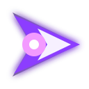

# Tilt Arena - mejoras e imagenes

| Imagen | Mejora | Funcion |
| --- | --- | --- |
|  | Flecha | Personaje del jugador. La imagen es grande, pero la hitbox real es pequena. |
|  | Hielo | Congela enemigos y destruye los cercanos al activar el pulso. |
|  | Misiles | Dispara una salva automatica a los enemigos mas cercanos. |
|  | Vortice | Absorbe enemigos hacia el centro y elimina los que entran demasiado. |
|  | Escudo | Protege durante unos segundos y destruye enemigos al contacto. |
|  | Sierra | Cuchillas orbitando alrededor de la flecha. |
|  | Rayo | Encadena golpes electricos entre muchos enemigos. |
|  | Punto rojo | Enemigo normal que persigue al jugador. |
|  | Punto elite | Enemigo mas grande y valioso. |
