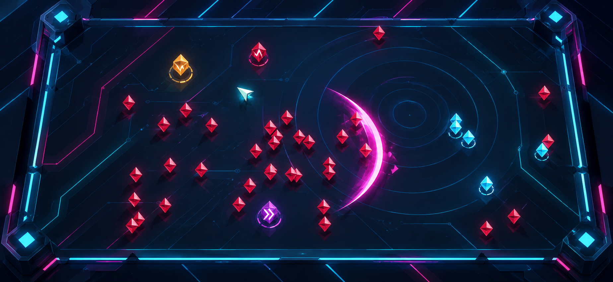
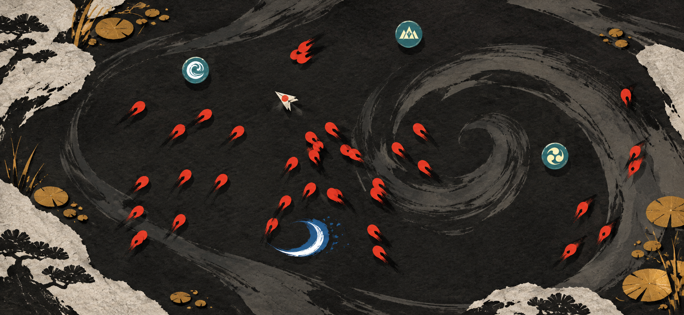
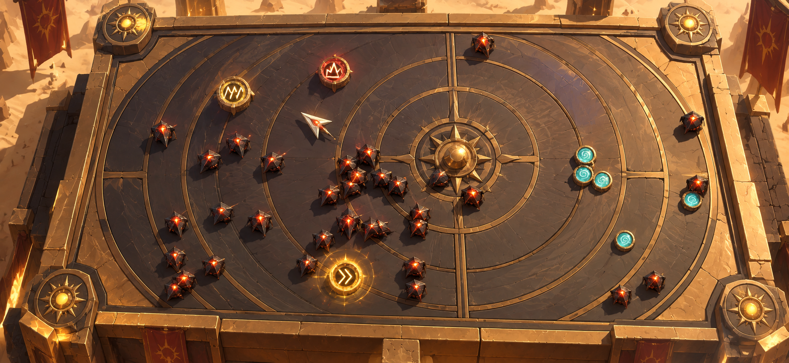
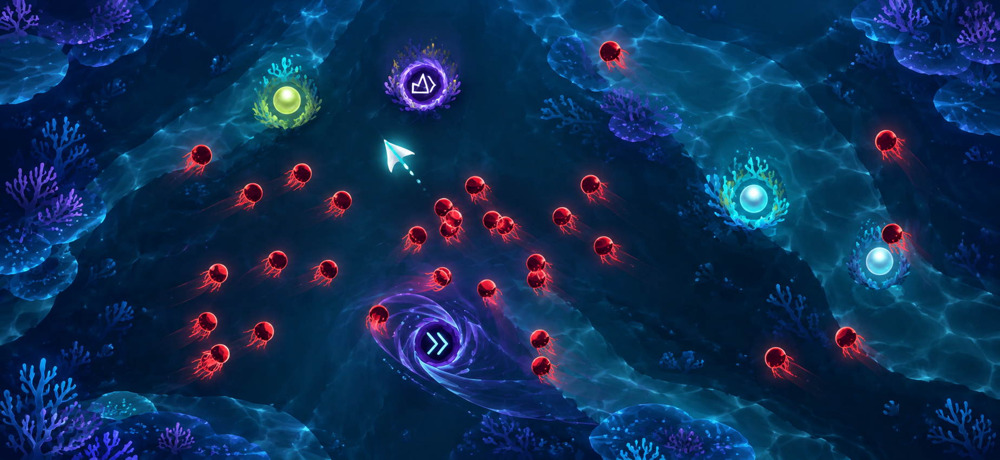

# Tilt Arena — visual directions

Selection phase, 21 September 2026. These are generated gameplay concepts for choosing a visual direction. They do not replace the approved art or claim to be implementation screenshots. The current [Tilt to Live App Store listing](https://apps.apple.com/us/app/tilt-to-live/id335454448) shows version 1.9.0 with an iOS/iPhone compatibility update; that reference was used only to avoid copying its assets or interface.

## 1. Prism Circuit

Dark indigo glass and circuit lanes give the arena a sharp, premium arcade identity. The arrow is an ivory prism, enemies are crimson holographic drones, and pickups become amber/cyan prisms. Movement can leave short cyan traces; attacks can use one clean magenta crescent or a narrow beam so the arena stays readable at high pressure.

Strength: clearest upgrade path from the current vector game and easiest to keep performant with SpriteKit shapes. Risk: the neon language is familiar, so the silhouettes and arena grammar must remain distinctive.

## 2. Ink Tide

Charcoal paper, vermilion brush-cut enemies and teal seal orbs make the arena feel illustrated and physical. The arrow reads as folded paper; powers can use one painted crescent, stamp, or slash with a small number of deliberate flecks. Motion should be expressed through broad directional strokes rather than continuous particles.

Strength: the most immediately ownable art identity. Risk: paper grain and brush edges need strict limits so they do not blur enemy gaps on a small screen.

## 3. Solar Forge

A bronze sundial arena with ceramic plates and ember-seamed enemies gives every movement lane a physical rhythm. The arrow is polished ivory metal, pickups are engraved seals, and powers can read as heat halos, solar lances, and short radial flares.

Strength: strong material hierarchy and a memorable world hook. Risk: the warm values need a cooler enemy accent to preserve instant threat recognition.

## 4. Abyss Bloom

An underwater midnight arena uses translucent water lanes, bioluminescent coral and crimson jellyfish-like enemies. The protagonist becomes a pearl-white manta arrow; pickups are luminous pearls; gravity can read as a controlled violet-black whirlpool with a cyan rim.

Strength: the strongest contrast between protagonist, enemy and power effects, with a natural home for the existing vortex fantasy. Risk: animated water and coral must remain mostly static or layered to protect frame time.

## Recommendation

Start with **Prism Circuit** for a first production pass: it preserves the current gameplay readability, supports crisp low-cost SpriteKit primitives, and still creates a clear identity change. Keep **Ink Tide** as the alternative if the priority is a more authored illustration language; it would require the most careful mobile readability pass.

All four images were generated as concepts with the built-in image generation tool using the current gameplay capture only as a composition reference. No original Tilt to Live assets or interface were copied.
